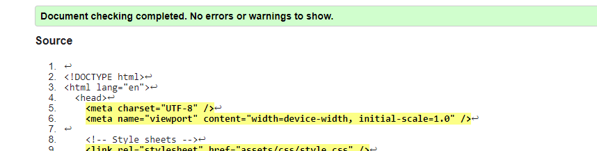

# Gravity Guru Quiz

The quiz has been made for school students to boost their knowledge of physics. The quiz contains 20 questions and 5 chances to fail. The purpose is to be used in the schools or be given as homework to make the study more fun. The questions are in the same order as the idea is to have the easy ones in the beginning and the complicated ones in the end.
The game has an option to have a sound on for those who would like it. It is fully responsive for the most common screen sizes.

## User Experience / UX

The visitors wish to see readable texts to be able to concentrate on the game.
The visitors wish to have clear instructions to be able to start the game. They expect to see clear navigations and be able to use all the possible gadgets for this game. The letters should be easy to read and the game should show a clear sign of how many questions there are as well as keep a score for the right and wrong answers.
It is important to have a timer on to keep the students concentrated on the questions instead of trying to use Google to find the answers.
Because the visitors of the page are going to be students there should be an option for a sound as young users usually like to have sound on to get the feeling. However, it is important to have the sound off as the user visits the page first. The sound should remind some sci-fi movies as physics and astronomy are connected.

The users should have the chance to restart the game regardless if they lost it or won if they wish to get better results.

## Features

## Existing Features

- The welcome page
  - On the welcome page the user has the chance to input the name and start the game
  - The user has a clear button for reading the instructions
  - The user can choose himself/herself to have a sound on or off.
  - It is mandatory to input the name to start the quiz.
  - It includes icons to make the user experience more fun as well as guide the user

- The background image
  - It has been chosen to complete the design of the quiz. It is a picture of a galaxy which is not so active to disturb, however makes a nice mood to do the quiz.

- The info section
  - It pops up when the user clicks on the INFO button. There are clear instructions about the quiz to help the user to start the game.

- The score section
  - When the user starts the game the score section shows up with clear signs of how many questions to expect.
  - It shows the score of the right answers and there are 5 boxes which are removed every time the user makes a wrong choice.
  - The timer counts down 30 seconds and when there are 5 seconds left it gets bigger to warn the user that the time is almost up, and then the game finishes.

- The questions and the options
  - Every question has 4 options. If the user answers wrong the color changes to red and when it is right, the color changes to red. After choosing the answer the timer stops to let the user click on next button to see the next question.

- The finish game section
  - When the game finishes the user sees a text which eighter informs the user that they lost the game or completed it. The use always has a choice to restart the game.

## Design

The background of the quiz complies with the mood and gives the user the feeling of a game or a sci-fi film.

The quiz includes sound effects as it had been requested in the user experience section. It is a bad user experience to have the sound on the quiz has the sound off as default. The user has the chance to have the sound on if they like. The sounds had been chosen carefully to keep the whole mood of the game and connect with the background image's theme.

The info button has a clear sign to guide the user to read the instructions before starting the quiz.

It is required to have a username to start the game.
The score bar shows clearly how many questions there are to give the user clear information on what to expect if they skipped reading the information about the quiz.

The user always has a chance to restart the game regardless if they won or lost. The quiz button had not been included as it does not serve any function. The user can close the window in case they don't want to play the quiz anymore.

### The design ideas before coding

## Testing

### Validator testing

The HTML had been validated at [validator.w3.org](https://validator.w3.org/nu/#textarea) and [wave.webaim.org](https://wave.webaim.org/).
Found errors in button types.

All of them had been fixed.

In Wave.webaim validator it warns that the webpage does not include heading, footer or nav bar.

The regions had not been added, because the quiz does not need to have them to function and give clear signs to the user.

The CSS had been validated at [jigsaw.w3.org](https://jigsaw.w3.org/css-validator/validator.html.en)
No errors had been found.

The JavaScript had been validated at [JShint](https://jshint.com/).
No errors had been found.

### Lighthouse testing

The lighthouse tests were successfull for both mobile phones and desktops

### Further testing

The page was tested on Google Chrome, Mozilla and Microsoft Edge browsers. Because Mozilla could not load .vaw files for sounds, all the sounds have been changed to mp3, as all the browsers could load them.

The page has been viewed on different devices, such as different mobile phones, on a laptop and 23" screen. It is responsive on all the screens.

## Unfixed bugs

Imported fonts appear to have a problem.

The message - does not load in parallel.

It is not possible to fix it as it is copied from Google Chrome.

The page shows an error Uncaught (in promise) Error: A listener indicated an asynchronous response by returning true, but the message channel closed before a response was received. It is not possible to fix the error as I have not used any promises.

## Deployment

The site was deployed to GitHub pages. The steps to deploy are the following:

- Open the GitHub repository and go to settings
- From the source section select the Master Branch
- Click on save then it will show that the deployment has been successful.
  The live link can be found here: [Gravity Guru](https://asyaharoyan.github.io/gravity-guru-quiz/)

  

## Credits

### Content and Media

- The questions had been copied from [Kupidonia](https://kupidonia.com/quiz-answers/physics-quiz-for-high-school-students), however the 4th options had been added by the developer
- The font had been downloaded from [Google fonts](https://fonts.google.com/?preview.text=Quiz%20Game&preview.size=35&preview.text_type=custom&query=Noto+Serif)
- The used font is Noto Serif but had been added sans-serif as well in case the browser would not load the first font
- The welcome text and the game over text had been written by the developer
- The colores had been chosen by the developer
- The sounds had been downloaded from [Freesound](https://freesound.org/people/Romariogrande/sounds/396231/)
- The favicon had been generated from [Favicon](https://favicon.io/)
- The background image had been downloaded from [Pixabay](https://pixabay.com/photos/cosmos-milky-way-night-sky-stars-1853491/)
- Except the background image there is a background color in case the image would not load on the browser
- The idea of having boxes instead of number for the wrong answers given by my mentor

### Coding instructions

- The instructions of how to load the page with animation had been taken from [Kevin Powell](https://www.youtube.com/watch?v=4prVdA7_6u0&t=347s)
- The help of making the functions had been taken from varios sources
  - [Web Dev Simplified](https://www.youtube.com/watch?v=riDzcEQbX6k)
  - [Udemy](https://www.udemy.com/course/javascript-the-complete-guide-2020-beginner-advanced/)
- The instructions of how to add sounds in the game had been taken from [Drew Conley](https://www.youtube.com/watch?v=hn7MhPt24L4)
